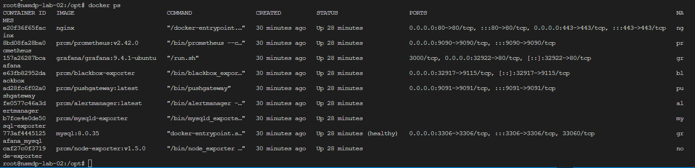
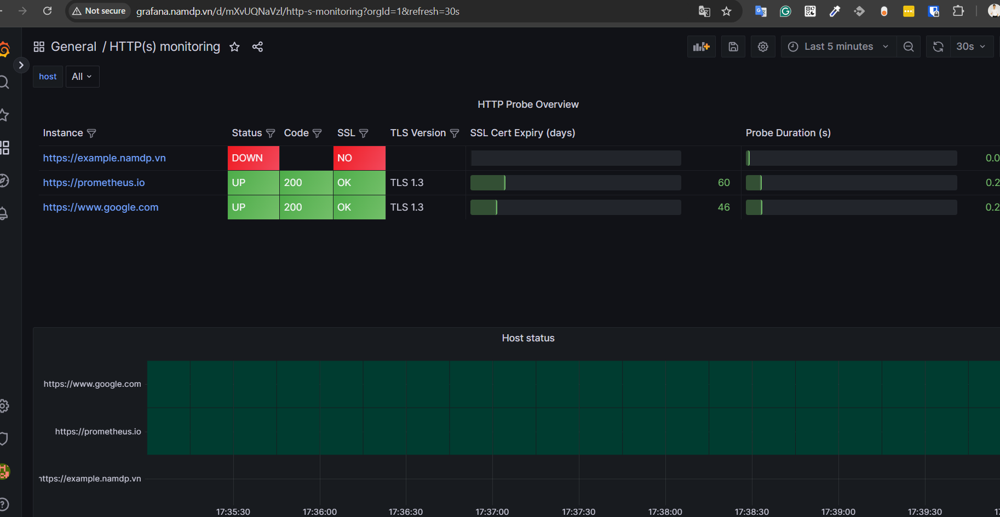
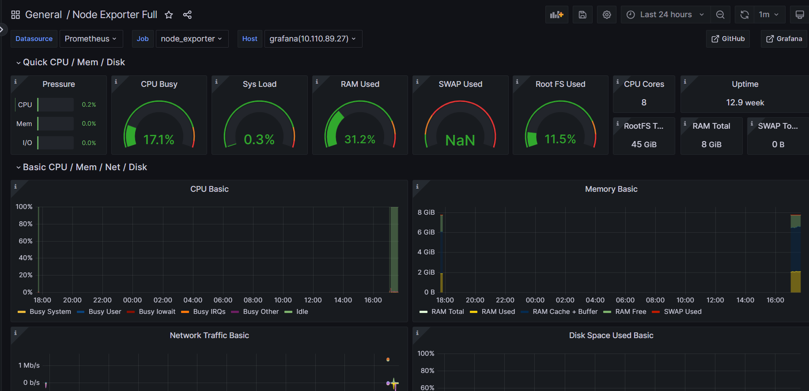
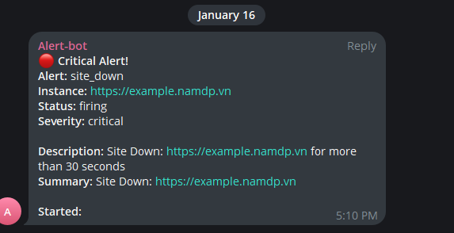

## The stack includes single instance for monitoring stack

- Grafana
- Prometheus
- Blackbox (example)
- Node-exporter (example)
- Mysql-expoter (example)
- MySQL DB
- AlertManager (firing to telegram)
## Requirement for monitor stack

- docker and docker-compose installation on machine.
- .env & .my.cnf config file for mysql credentials.
- Update the correct IP in config file form example 10.110.89.27 to your IP.
- Update the hostname or point the DNS in the ./data/grafana/grafana.ini
## Update folder and files permissions

```$ chmod 0644 data/nginx/nginx.conf data/grafana/grafana.ini data/prometheus/prometheus.yml data/blackbox/config.yml```

```$ chmod -R 755 data/blackbox/data data/prometheus/data```

```$ chown root. .env data/nginx/nginx.conf```

```$ chown -R 472:472 data/grafana/grafana.ini data/grafana/data```

```$ chown nobody:nogroup -R data/prometheus/data data/prometheus/prometheus.yml```

## Up the stack

```$ docker-compose -f docker-compose.yml up -d```

## Output







